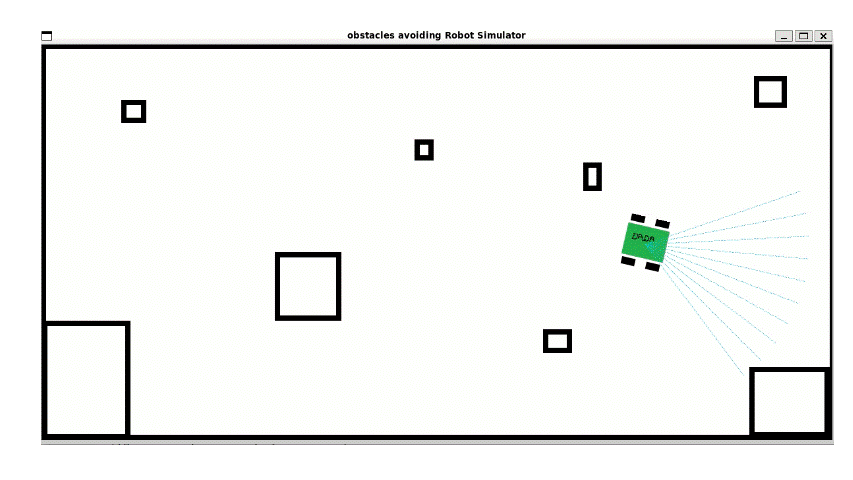

# Obstacles Avoiding Robot Simulator Project
[](LICENSE)
[](CONTRIBUTING.md)

Welcome to the **Obstacles Avoiding Robot Simulator Project** :  an interactive simulation that brings robotics and AI to life! This project is designed to simulate a robot navigating through a dynamic environment filled with obstacles, using cutting-edge algorithms to avoid collisions.



## Table of Contents
- [Introduction](#introduction)
- [Features](#features)
- [Installation](#installation)
- [Usage](#usage)
- [Classes and Functions](#classes-and-functions)
- [Contributing](#contributing)
- [License](#license)

## Overview

The Obstacles Avoiding Robot Simulator Project is a hands-on platform for enthusiasts and developers alike to experiment with robotics algorithms in a simulated environment. It is ideal for learning about:
- Sensor integration and real-time data processing.
- Path planning and obstacle avoidance techniques.
- Simulation environments for robotics applications.

This simulator provides an excellent base to experiment with various AI techniques, making it a useful tool for both academic purposes and personal projects.

## Features

- **Real-Time Simulation:** Visualize your robot navigating through a dynamic obstacle course.
- **Customizable Environment:** Easily modify the simulation parameters and add custom obstacles.
- **Modular Design:** The project structure supports plug-and-play modules for different sensors and control algorithms.
- **Interactive Controls:** Adjust simulation speed, sensor sensitivity, and robot behavior on the fly.
- **Extensible Codebase:** Designed with open-source principles in mind, encouraging contributions and enhancements.


## Installation

### Prerequisites

Before you begin, ensure you have met the following requirements:
- [Python 3.8+](https://www.python.org/downloads/) installed on your machine.
- Basic knowledge of Python and simulation concepts.
- Git installed to clone the repository.

1. Clone the repository:
    ```sh
    git clone https://github.com/DadaNanjesha/robotics.git
    ```
2. Navigate to the project directory:
    ```sh
    cd robotics_project
    ```
3. Install the required dependencies:
    ```sh
    pip install -r requirements.txt
    ```

## Usage

1. Run the main simulation script:
    ```sh
    python main.py
    ```
2. The simulation window will open, showing the robot navigating through the environment.

## Classes and Functions

### [robot.py](http://_vscodecontentref_/1)

- **`point_distance(p1, p2)`**: Calculates the Euclidean distance between two points.
- **`Robot`**: Class representing the robot.
  - **`__init__(self, start_pos, width)`**: Initializes the robot with a starting position and width.
  - **`move(self, distance, angle)`**: Moves the robot by a certain distance and angle.
  - **`get_position(self)`**: Returns the current position of the robot.
  - **`get_heading(self)`**: Returns the current heading angle of the robot.
  - **`set_speed(self, vl, vr)`**: Sets the speed of the robot's wheels.
  - **`detect_obstacle(self, distance)`**: Detects if there is an obstacle within a certain distance.
  - **`update_countdown(self, time_elapsed)`**: Updates the countdown timer.
  - **`avoid_obstacles(self, obstacles, dt)`**: Avoids obstacles by moving backwards if an obstacle is detected.
  - **`move_backwards(self)`**: Moves the robot backwards.
  - **`move_forwards(self)`**: Moves the robot forwards.
  - **`kinematics(self, dt)`**: Updates the robot's position based on its speed and heading.
  - **`update(self, obstacles, dt)`**: Updates the robot's state, including position, speed, and obstacle avoidance.

### [main.py](http://_vscodecontentref_/2)

- Sets up the simulation environment and runs the main loop.
- Initializes the robot and graphics.
- Handles events and updates the robot state.
- Renders the graphics and updates the display.

## Contributing

Contributions are welcome! Please read our [Contributing Guidelines](CONTRIBUTING.md) to learn about our code of conduct, pull request process, and more.

If you want to report a bug or suggest a feature, please open an [Issue](https://github.com/DadaNanjesha/Obstacles-Avoiding-Robot-Simulator-Project/issues).

## License

This project is licensed under the MIT License. See the [LICENSE](LICENSE) file for details.

---

*Happy Simulating!*
